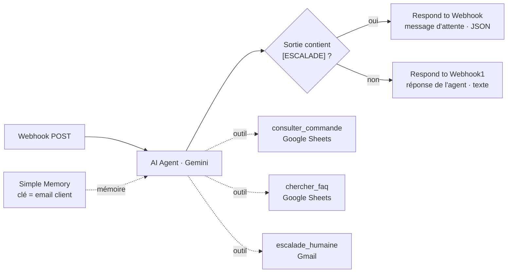

# Agent IA de support client (n8n)

Agent conversationnel autonome qui traite les demandes de **support client de premier niveau** :
suivi de commande, questions FAQ (retours, livraison, paiement, annulation) et **escalade vers un
humain** pour tous les cas sensibles.

Construit sur **n8n** avec un LLM **Google Gemini**, une **mémoire conversationnelle par client**
et **trois outils métier**. L'agent analyse chaque demande entrante et décide seul de l'action à
prendre, dans le respect de règles strictes définies dans son prompt système.

---

## Fonctionnement



1. Un `POST` sur le **webhook** transmet le message du client et son email.
2. L'**AI Agent** (Gemini) lit le message, récupère l'historique via la **mémoire**
   (clé = email du client) puis décide de manière autonome des outils à appeler.
3. Conformément à son **prompt système**, il **escalade systématiquement** les cas sensibles en
   préfixant sa réponse finale par le tag `[ESCALADE]` suivi d'un résumé pour l'équipe.
4. Le nœud **If** détecte ce tag et route la réponse :
   - **tag présent** → l'API renvoie un message d'attente neutre au client (l'humain a déjà été
     prévenu par email via l'outil `escalade_humaine`) ;
   - **tag absent** → l'API renvoie directement la réponse rédigée par l'agent.

---

## Les trois outils

| Outil | Type | Rôle |
|-------|------|------|
| `consulter_commande` | Google Sheets | Recherche une commande par `numero_commande` → statut, date de livraison estimée, transporteur |
| `chercher_faq` | Google Sheets | Recherche une réponse dans la FAQ officielle par mot-clé (retours, livraison, paiement, annulation…) |
| `escalade_humaine` | Gmail | Envoie un email récapitulatif à l'équipe support : email du client, message original, raison de l'escalade |

---

## Règles d'escalade (prompt système)

L'agent bascule vers un humain dès que :

- le client exprime une **plainte**, de la **colère** ou une **insatisfaction** ;
- la demande concerne un **remboursement**, une **réclamation** ou un **litige** ;
- il **n'est pas sûr à 100 %** de sa réponse ;
- la question **sort du cadre support** (juridique, presse, partenariat).

Il n'invente jamais d'information sur une commande ou une politique : si un outil ne renvoie rien,
il le signale clairement au client et escalade.

---

## Prérequis

- Une instance **n8n** (cloud ou self-hosted).
- Credentials à configurer dans n8n :
  - **Google Gemini (PaLM) API** — clé obtenue sur Google AI Studio ;
  - **Google Sheets OAuth2** — accès aux deux feuilles de données ;
  - **Gmail OAuth2** — compte qui envoie les emails d'escalade.
- Deux **Google Sheets** (structure ci-dessous).

### Structure attendue des Google Sheets

**`commandes_test`** (1re feuille) :

| numero_commande | statut | date_livraison_estimee | transporteur |
|-----------------|--------|------------------------|--------------|
| CMD-1001 | Expédiée | 2026-09-10 | Chronopost |
| CMD-1002 | En préparation | 2026-09-12 | Colissimo |

**`faq_test`** (1re feuille) :

| question | reponse |
|----------|---------|
| Quelle est votre politique de retour ? | Vous disposez de 30 jours après réception pour retourner un article non utilisé, avec l'étiquette d'origine. |
| Combien de temps prend la livraison ? | La livraison standard prend entre 3 et 5 jours ouvrés. |
| Comment annuler ma commande ? | Vous pouvez annuler votre commande dans les 2 heures suivant l'achat depuis votre espace client. |
| Acceptez-vous les paiements en plusieurs fois ? | Oui, le paiement en 3 fois sans frais est disponible à partir de 100 € d'achat. |

---

## Installation

1. Dans n8n : **Workflows → Import from File** → sélectionner `workflow.json`.
2. Ouvrir chaque nœud signalé en rouge et **réassocier les credentials** (Gemini, Google Sheets, Gmail).
3. Dans `consulter_commande` et `chercher_faq`, faire pointer **Document** et **Sheet** vers vos propres Google Sheets.
4. Dans `chercher_faq`, remettre la **colonne de recherche** (*Lookup Column*) sur `question` — voir *Notes*.
5. Dans `escalade_humaine`, remplacer l'adresse `sendTo` par celle de votre équipe support.
6. Activer le workflow et récupérer l'**URL de production** du webhook.

---

## Utilisation

```bash
curl -X POST https://<votre-instance-n8n>/webhook/<id-webhook> \
  -H "Content-Type: application/json" \
  -d '{
    "message": "Bonjour, où en est ma commande CMD-1001 ?",
    "client_email": "client@example.com"
  }'
```

**Réponse normale** (texte brut) :

```
Votre commande CMD-1001 est expédiée. Livraison estimée le 10/09/2026 via Chronopost.
```

**Réponse en cas d'escalade** (JSON) :

```json
{ "reply": "Merci pour votre message, un membre de notre équipe va vous recontacter rapidement." }
```

En parallèle, l'équipe reçoit un email d'escalade avec le contexte complet de la demande.

---

## Notes et limites

- **`chercher_faq`** : dans l'export, le champ *Lookup Column* du nœud contient un collage parasite
  (tout le tableau FAQ au lieu du seul nom de colonne). Le remettre à `question` après import.
- Les `documentId` des Google Sheets et les identifiants de credentials sont propres à l'instance
  d'origine : ils doivent être remplacés par les vôtres.
- `"active": false` dans l'export — le workflow doit être **réactivé manuellement** après import.
- La mémoire est une fenêtre glissante en RAM (`memoryBufferWindow`) : elle est perdue au
  redémarrage de n8n et n'est pas partagée entre instances.
- Le webhook n'a pas d'authentification dans cette version : ajouter une clé d'API ou un header
  secret avant une mise en production réelle.

---

## Structure du dépôt

```
.
├── workflow.json     # export n8n du workflow complet
├── README.md
└── docs/
    └── canvas.png    # capture du canvas n8n
```
